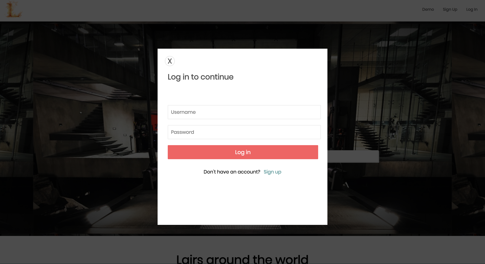

# Lair-BnB

[Try out Lair-BnB!][heroku]
[heroku]: http://lair-b-n-b.herokuapp.com/

Lair-BnB is for the superhero (or villain) in all of us! On this website, you are able to book lairs for next action packed get-away! This project was inspired by Air-BnB.

This website was developed in roughly 10 days. Visit back soon for further improvements more features!

## Current Features

* User Authentication - secure signup and login
* Splash page with a preview of the website
* Ability to view the website and lairs while logged out
* Once logged in, users are able book lairs
* Users can view their bookings and delete them

### Splash

## Technologies Used

* Ruby
* Ruby on Rails
* JavaScript
* React
* Redux
* Google Maps API
* PostgreSQL
* HTML
* CSS

## Future Possible Feature (to come soon!)

* Search capability
* Ability to become hosts and post lairs
* Updated photo library & listings
* Allow users to review listings if they have stayed there
* Richer user signup and profile features

### Splash Page



* Modal pop up functionality for users to sign up and/or login.
* Search bar moves location weather a user is logged in
* Preview of all Lairs while on home page

**Format:**

* [ ] Uses markdown formatting
* [ ] Includes code snippets (with triple backticks, and the language ` ```javascript...``` `)
* [ ] Includes screenshots / gifs

**Optional:**

* [ ] Describes technical challenges
* [ ] Add `topics` to the top of the repo

This README would normally document whatever steps are necessary to get the
application up and running.

Things you may want to cover:

* Ruby version

* System dependencies

* Configuration

* Database creation

* Database initialization

* How to run the test suite

* Services (job queues, cache servers, search engines, etc.)

* Deployment instructions

* ...

**Content:**

* [ x ] Has a `# Title`
* [ x ] Links to the Wiki design documents
* [ x ] Describes technologies used
* [ x ] Describes core functionality
* [ x ] Lists future directions
* [ x ] Fills out `Description` and `Website` at the top of the repo.
