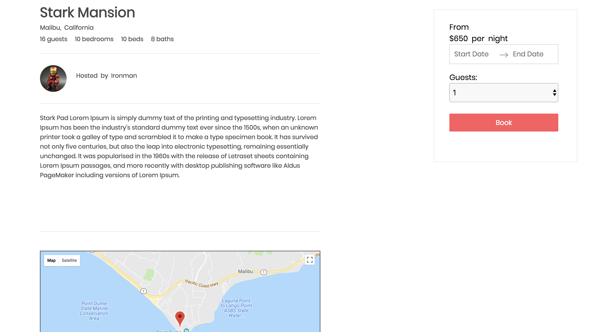
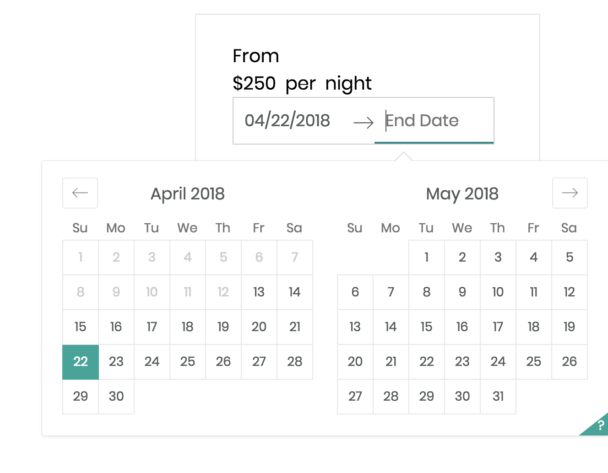
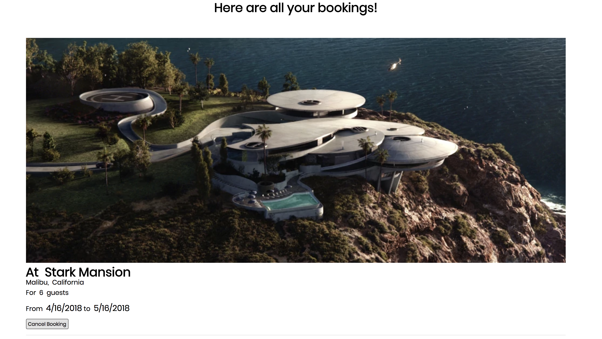

# Lair-BnB

[Try out Lair-BnB!][heroku]
[heroku]: http://lair-b-n-b.herokuapp.com/

Lair-BnB is for the superhero (or villain) in all of us! On this website, you are able to book lairs for next action packed get-away! This project was inspired by Air-BnB.

This website was developed in roughly 10 days. Visit back soon for further improvements more features!

## Current Features

* User Authentication - secure signup and login
* Splash page with a preview of the website
* Ability to view the website and lairs while logged out
* Once logged in, users are able book lairs
* Users can view their bookings and delete them

### Splash

## Technologies Used

* Ruby
* Ruby on Rails
* JavaScript
* React
* Redux
* Google Maps API
* PostgreSQL
* HTML
* CSS

### Splash Page


* Modal pop up functionality for users to sign up and/or login.
* Search bar moves location weather a user is logged in
* Preview of all Lairs while on home page

### Check out the Lairs!


* Shows all the lair's available to book
* Map show's listings locations
* Map not visible unless logged in (page layout changes smoothly)
  
* Lair show page shows a description of the lair along with booking form
* Map relocates to show current Lair's location

### Book a Lair!



* Easy booking form to request to book a Lair
* React-dates used for calendar and date picking
* Successful booking leads you to you all of your bookings
  
* User can see details of booking and delete booking if needed

```javascript
const mapStateToProps = ({ session, entities }) => {
  const bookings = Object.values(entities.bookings).filter(
    booking => booking.guest_id === session.currentUser.id
  );
  const listings = uniq(
    bookings.map(booking => entities.listings[booking.listing_id])
  ).filter(listing => listing !== undefined);

  return {
    currentUser: session.currentUser,
    bookings,
    listings
  };
};
```

* Filtering in and passing in necessary props in order to pass information through multiple slices of state and have them persist to database accurately was a challenging task which tested my logical thinking ability and process of thought.

### Locating a listing

* Re-positioning the map to show location of current listing vs mapping to a set location is a feature that increases the value of the user experience

```javascript
componentDidMount() {
  // set the map to show SF
  let centerLatitude = this.props.listing
    ? this.props.listing.latitude
    : 37.7758;
  let centerLongitude = this.props.listing
    ? this.props.listing.longitude
    : -122.435;
  const mapOptions = {
    center: {
      lat: centerLatitude,
      lng: centerLongitude
    }, // this is SF
    zoom: 13
  };

  this.map = new google.maps.Map(this.mapNode, mapOptions);
  this.MarkerManager = new MarkerManager(
    this.map,
    this.handleMarkerClick.bind(this)
  );
  if (this.props.singleListing) {
    this.MarkerManager.createMarkerFromListing(this.props.listing);
  } else {
    this.registerListeners();
    this.MarkerManager.updateMarkers(Object.values(this.props.listings));
  }
}
componentDidUpdate() {
  if (this.props.singleListing) {
    const targetListingKey = Object.keys(this.props.listings)[0];
    const targetListing = this.props.listings[targetListingKey];
    this.MarkerManager.updateMarkers([targetListing]);
  } else {
    this.MarkerManager.updateMarkers(Object.values(this.props.listings));
  }
}
```

* Future search capabilities will allow you to view the maps within the searf parameters

## Future Possible Feature (to come soon!)

* Search capability
* Ability to become hosts and post lairs
* Updated photo library & listings
* Allow users to review listings if they have stayed there
* Richer user signup and profile features
